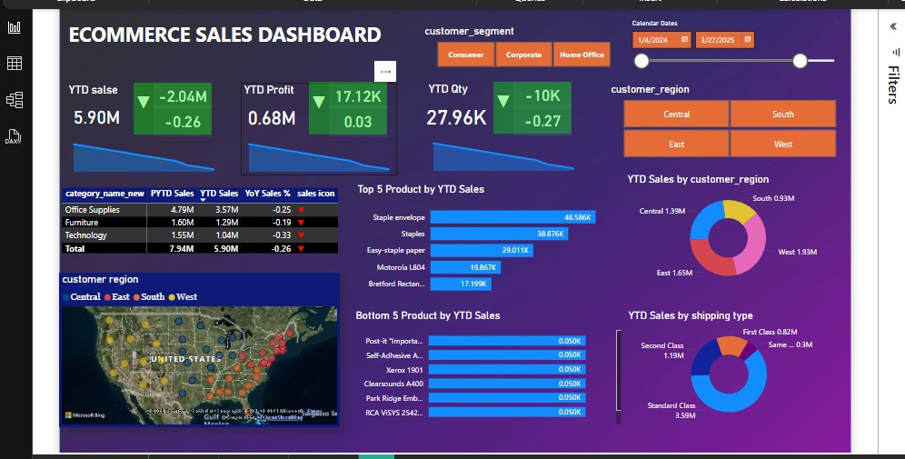

# 📊 Ecommerce Sales Dashboard (End-to-End Project)

This end-to-end data analytics project leverages *SQL, Python (pandas), Excel, and Power BI* to deliver a fully interactive ecommerce performance dashboard.

## 🛠 Tools & Technologies:
- *SQL* – Data extraction & filtering from database
- *Python (pandas)* – Data cleaning, transformation, preprocessing
- *Excel* – Initial data validation and structure setup
- *Power BI* – Data modeling, DAX, visualization & reporting

## 📌 Dashboard Features:
- YTD Sales, Profit, and Quantity KPIs with YoY comparison
- Category-wise and customer segment breakdown
- Top 5 and Bottom 5 products by YTD sales
- Region-wise sales mapped across the U.S.
- Shipping type-wise sales analysis
- Dynamic filters for time period, region, and segment

## 💡 Outcome:
The dashboard enables strategic insights by identifying high-performing products, underperforming regions, and customer trends, supporting data-driven decision-making.

